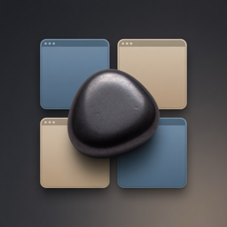
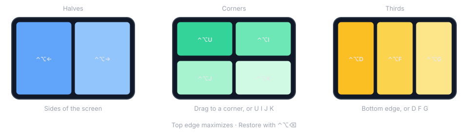

# Loadstone

<p align="center">
  
</p>

<p align="center">
  <strong>Snap any Mac window into place.</strong><br>
  Halves, corners, and thirds — from the keyboard or by dragging to an edge.<br>
  A native Swift menu-bar app. No dock icon. No Electron.
</p>

<p align="center">
  
  
  
</p>

Loadstone sits in the menu bar and stays out of the way. When you need two docs side by side, a browser in a third, or a window parked in a corner, it moves the frontmost window to a precise tile of the visible screen — dock and menu bar included in the math, not covered by the window.

<p align="center">
  
</p>

## Features

- **Halves** — left, right, top, bottom
- **Corners** — four quarters
- **Thirds** — left, center, right, plus two-thirds
- **Maximize, center, restore** — restore puts the window back where it was before Loadstone first moved it
- **Drag to snap** — edges for halves, corners for quarters, top to maximize, bottom for thirds. Only a window that is actually being dragged snaps; selecting text or dragging a slider near an edge does nothing
- **Multi-display** — send a window to the next or previous screen, walking displays left to right as they sit on the desk
- **Custom shortcuts** — Magnet-style defaults, all editable
- **Launch at login** — optional, from Settings
- **Portrait screens** — the side edges split three ways along their length (corner, vertical third, corner); the bottom edge gives halves

Loadstone turns off macOS’s built-in “drag to tile” (System Settings → Desktop & Dock → Windows) while it is running, so the two systems don’t fight, and turns it back on when it quits. If Loadstone is force-quit or crashes, re-enable it there yourself.

## Default shortcuts

All of these are Control-Option unless noted. Change them in **Settings → Shortcuts**.

| Layout | Shortcut |
| --- | --- |
| Left / right / top / bottom half | `⌃⌥←` `⌃⌥→` `⌃⌥↑` `⌃⌥↓` |
| Top left / top right corner | `⌃⌥U` `⌃⌥I` |
| Bottom left / bottom right corner | `⌃⌥J` `⌃⌥K` |
| Left / center / right third | `⌃⌥D` `⌃⌥F` `⌃⌥G` |
| Left / right two thirds | `⌃⌥E` `⌃⌥T` |
| Maximize | `⌃⌥↩` |
| Center (keeps the current size) | `⌃⌥C` |
| Restore | `⌃⌥⌫` |
| Next / previous display | `⌃⌥⌘→` `⌃⌥⌘←` |

The corner keys are a square on the keyboard:

```
U  I
J  K
```

## Install

### Download

Grab **Loadstone.app** from the [latest release](https://github.com/mortenbrudvik/loadstone/releases/latest), unzip it, and drag it to **Applications**.

The release is signed with Developer ID and **notarized by Apple**, so Gatekeeper should accept a normal double-click.

Apple Silicon (arm64) only, macOS 14+.

### Accessibility (required)

Loadstone moves other apps’ windows through the Accessibility API. macOS will not apply the permission until the app restarts, and it ties the permission to the app’s code signature, so a rebuilt or updated app can look enabled in the list without being so. That is why step 2 removes the old entry.

1. System Settings → **Privacy & Security** → **Accessibility**
2. If Loadstone is already listed, select it and click **−**
3. Click **+** and choose **`/Applications/Loadstone.app`**
4. Turn it **on**
5. Menu bar → Loadstone → **Relaunch**

After that, `⌃⌥←` should pin the frontmost window to the left half.

Optional: **Settings → Launch at login**.

### Build from source

**You need:** macOS 14+, Xcode 16+, [Homebrew](https://brew.sh), [XcodeGen](https://github.com/yonaskolb/XcodeGen).

```bash
brew install xcodegen
git clone https://github.com/mortenbrudvik/loadstone.git
cd loadstone
xcodegen
xcodebuild -scheme Loadstone -configuration Release -destination 'platform=macOS' \
  CODE_SIGN_IDENTITY=- ENABLE_HARDENED_RUNTIME=NO OTHER_CODE_SIGN_FLAGS= build
```

The Release configuration is set up to sign with the maintainer’s Developer ID. The overrides above fall back to an ad-hoc signature so the build works on any Mac.

Copy the built app into Applications (path will include your DerivedData folder):

```bash
ditto "$(find ~/Library/Developer/Xcode/DerivedData -path '*/Build/Products/Release/Loadstone.app' | head -1)" /Applications/Loadstone.app
open /Applications/Loadstone.app
```

Then grant Accessibility as above.

## Build and test

```bash
xcodegen                      # regenerate the Xcode project after adding files
xcodebuild -scheme Loadstone -destination 'platform=macOS' test
```

Open `Loadstone.xcodeproj` in Xcode if you prefer a GUI.

## How it works

Loadstone is a menu-bar-only app (`LSUIElement`). Shortcuts and drag gestures go to a small window director that:

1. Finds the window (Accessibility)
2. Converts between Cocoa and Accessibility coordinates
3. Lays out a tile against the screen’s **visible frame**
4. Sets size, then position, then size again so the window survives a display change
5. Reports what the app answered: a window that refuses to move makes Loadstone beep and log to Console (subsystem `com.brudvik.loadstone`)

Drag snapping only arms once the window under the pointer has actually moved, so a text selection or a slider dragged to a screen edge is left alone.

It is **not sandboxed**. App Sandbox blocks the Accessibility calls this kind of tool needs.

## Name

A lodestone is a naturally magnetic rock. Loadstone is the window magnet.

## License

No license file yet — all rights reserved until one is chosen.
